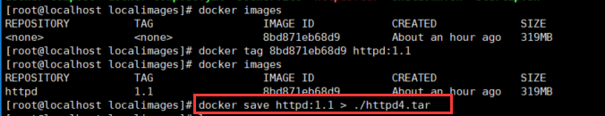

### Docker打包httpd镜像

- (1)docker pull centos 下载centos镜像；
- (2)docker create centos 使用centos镜像创建一个容器；
- (3)docker run -i -t --name=docker_run centos bash 运行创建的容器并指定容器名；

    -i : 为容器打开标准输入;

    -t : 创建一个新的命令行;

    -name : 指定容器名称;

    centos : 指定启动容器使用的镜像;

    /bin/bash: 告诉docker要在容器内执行此命令；
- (4)docker commit 4f2a52ce9385 bugsos 将4f2a52ce9385 容器打包为bugsos镜像；
- (5)docker save 56bd3610a51d > ./bugsos.tar 导出容器保存为镜像；
- (6)Docker tag可以给镜像命名；（docker tag 5182e96772bf httpd:1.0）

 

#### 遇到的问题&解决方案
- (1)docker build -t centos:httpd .
. 代表Dockerfile文件, 生成的镜像名称为centos:httpd

- 启动httpd容器命令：
  docker run -it -d --privileged -p 80:80 --name=http_max httpd:1.0 /sbin/init

- 问题：解决systemctl启动服务报错问题；
- 措施：
docker run --privileged -d -p 10080:80 centos /sbin/init
--privileged : 该参数使root用户拥有root权限；

#### 分享docker很系统的知识链接：
>    https://yeasy.gitbooks.io/docker_practice/introduction/what.html
