### 核心git命令介绍&记录
- `git commit`

 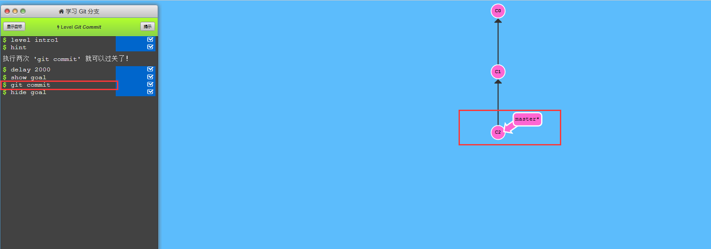

- `git checkout -b bugfix ； git commit` 创建并切换到bugfix分支，并在bugfix上提交；

 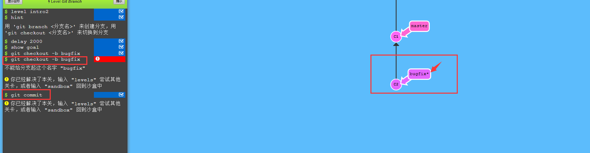

- `git checkout -b bugfix`建新的分支，*表示当前处于该分支

 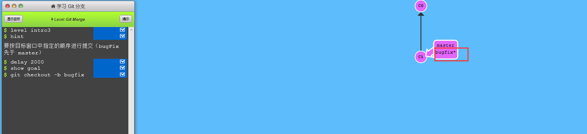

 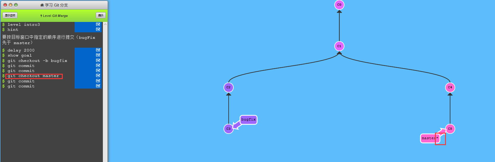

- `git merge bugfix` 把bugfix分支合并到当前*所在分支；

 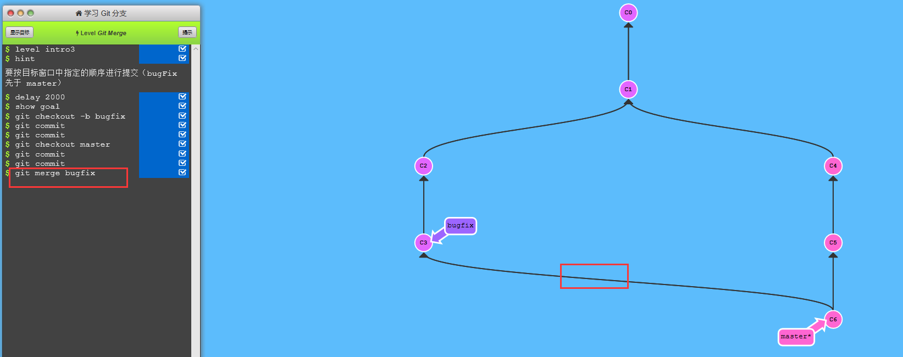

 如果存在包含需要合并内容的最新节点，则直接移动分支节点位置；

  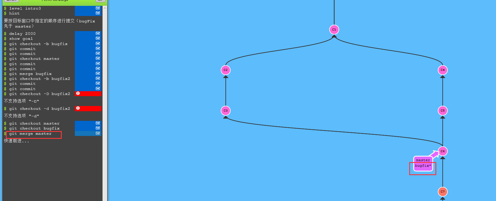

- `git rebase`  取出一系列提交记录，“复制它们”，然后在另一个地方逐个放下去；

  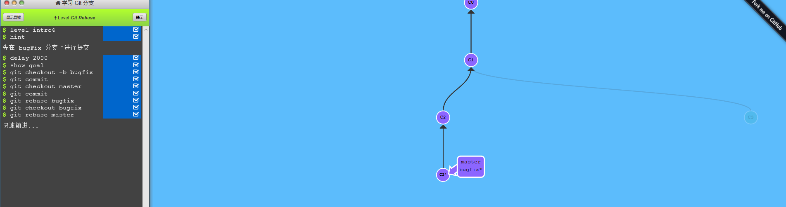

- `HEAD`:

   1. HEAD 是一个对当前检出记录的符号引用 —— 也就是指向你正在其基础上进行工作的提交记录。
   2. HEAD 总是指向当前分支上最近一次提交记录。大多数修改提交树的 Git 命令都是从改变
   3. HEAD 的指向开始的。HEAD 通常情况下是指向分支名的（如 bugFix）。在你提交时，改变了 bugFix 的状态，这一变化通过 HEAD 变得可见。

  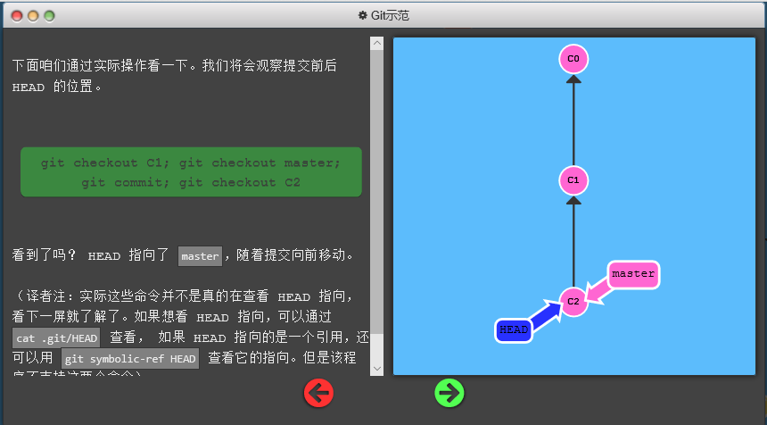

- `Git checkout 版本号` 指定HEAD到当前版本;

  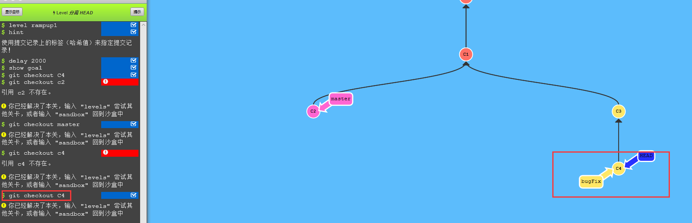

- 相对引用‘^’:

  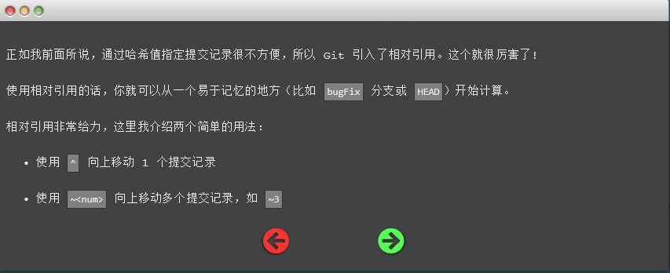

- `Git checkout bugFix^` 操作位置跳转到bugfix分支上一个父节点；

  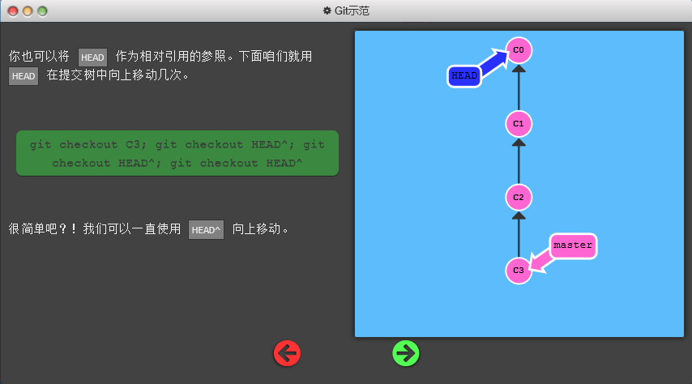

- `Git checkout HEAD~4` 从当前位置HEAD上移4个；

  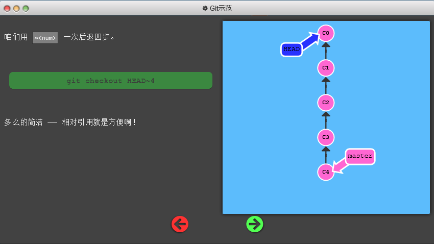

  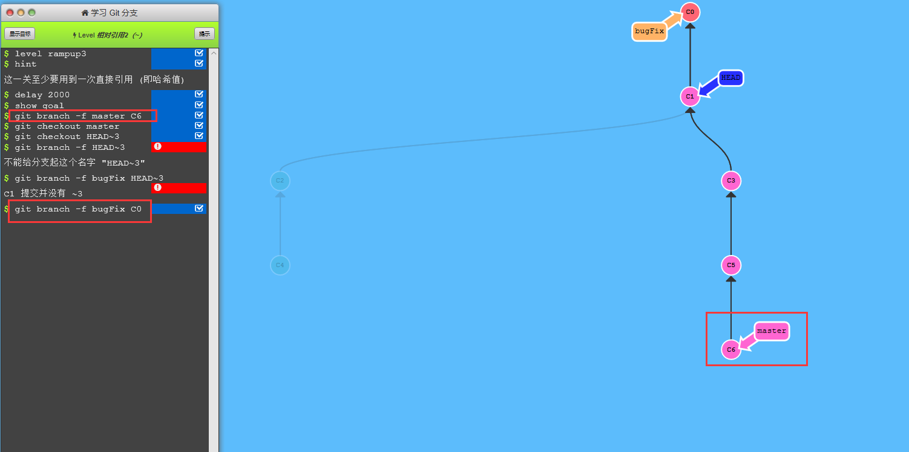

- `Git reset`
  本地将代码回滚一次，但是修改项只在本地，未在缓存区；对远程不影响。

  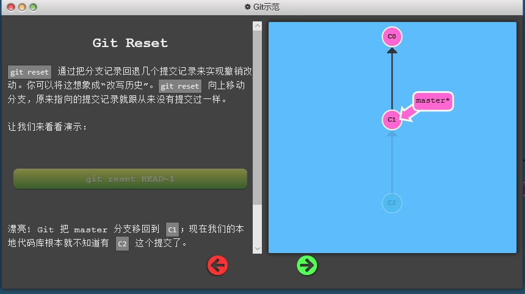

- `Git revert`

  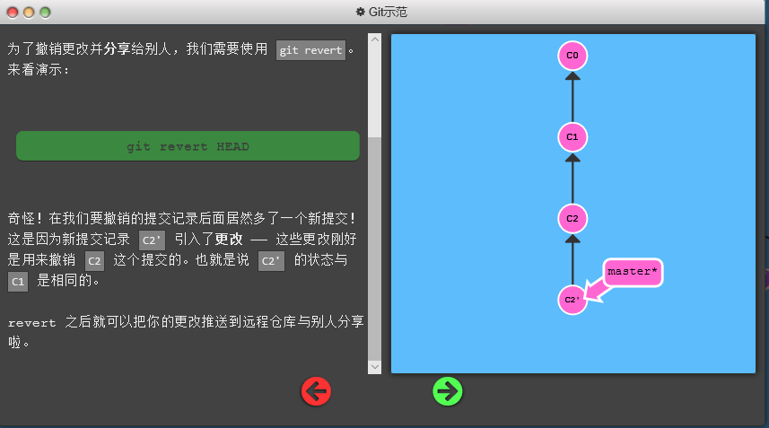

- `Git cherry-pick` 获取其他分支版本号，直接把对应修改合并到当前分支。

  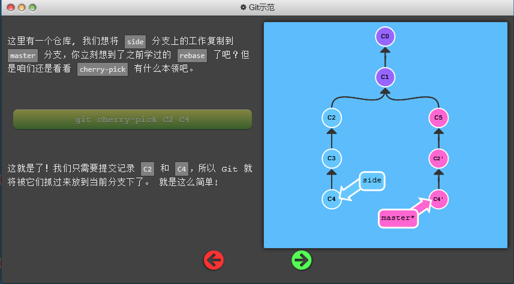

- `Git clone`

  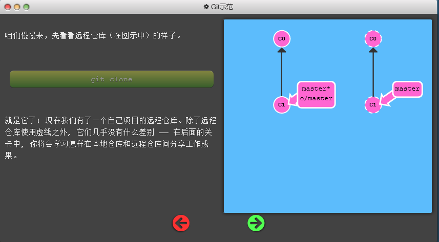

- 远程分支命名规范：

  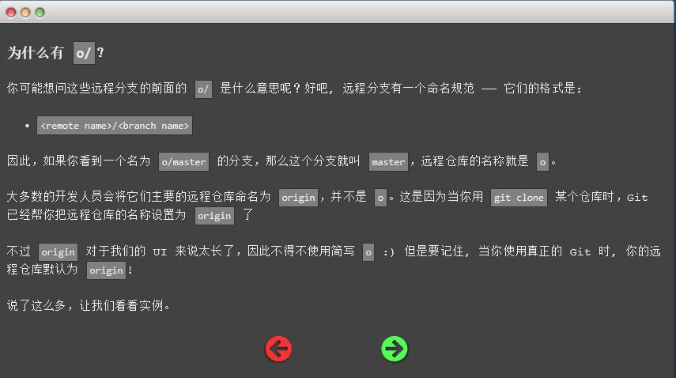

- `Git fetch` 下载所有仓库的数据；

  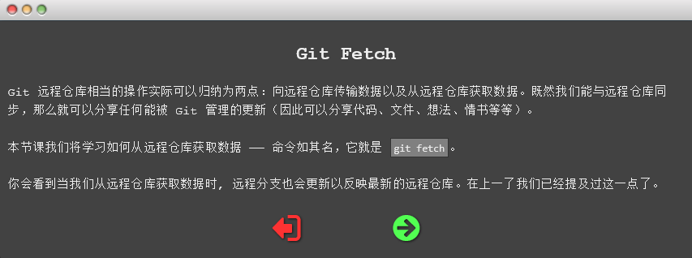

  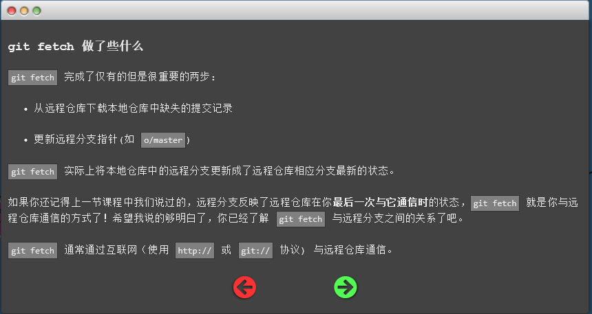

- `Git pull`

  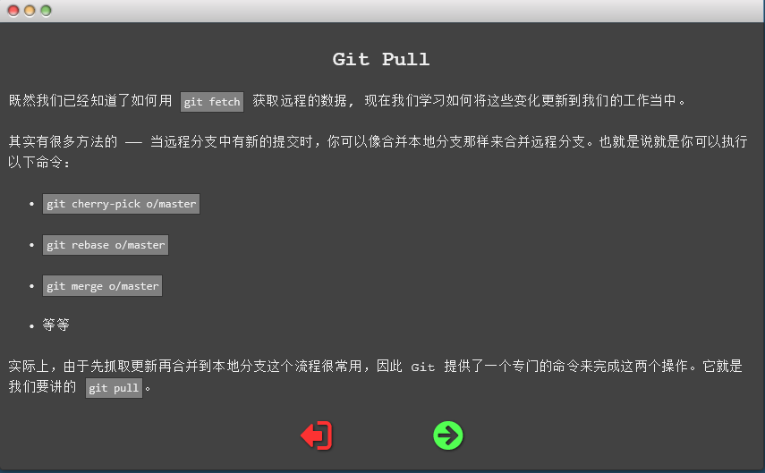

- `Git push`

  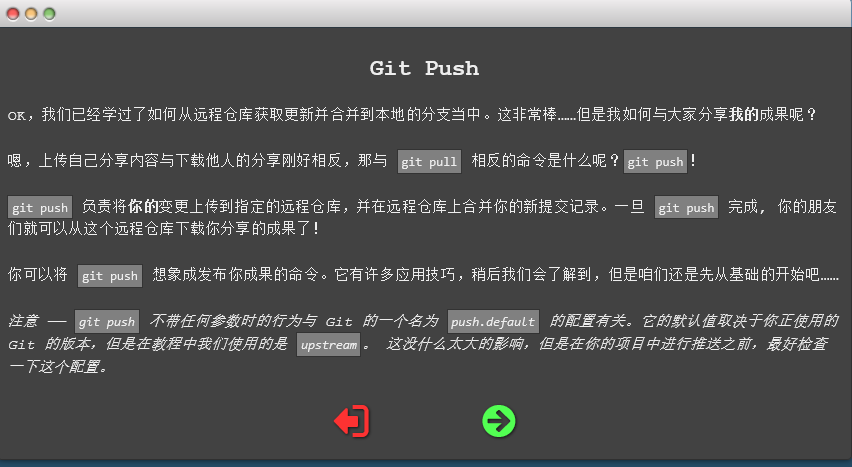

  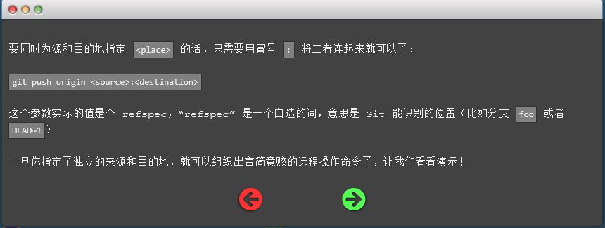

  实践环境链接如下：[我要实践](https://learngitbranching.js.org/?NODEMO)
